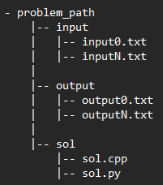

# Dizzy tester
Automated tester for _**python/c++**_ solutions to Competitive Programming problems.<br>
Created fully in Python.

Basically, like an online judge, but local and simpler(for now).
I use it when I need to test my solutions for problems I'm setting up.

## Requirements:
Python >= 3.9

## Installation:
1. Clone repository or Download zip file and then extract it.
2. Open terminal in root folder of the app and use the command:
    ```
    pip install -r requirements.txt
    ```

## Run app:
Again using the terminal, in the root folder of the app, type the command:
```
python app.py
```

## Usage:
1. In the app, click on the _"Add problem"_ button.
2. Enter the directory where the problem is located.
3. Enter the location of the solution file.
   - By default, the app will use the file **sol.cpp** or **sol.py** in the /sol subdirectory.

## Format for problem directory:
### The directory must have the following structure:<br>
That way the app will be able to find the input and output files for the problem.
<br>
input and output files must be named using the format _input**N**.txt_ and _output**N**.txt_, where **N** is the number of the test case. <br>
There can be as many test cases as you want.



_**sol.cpp** and **sol.py** files are optional, but if they exist, the app will use them, in the case the user doesn't specify a solution file._
